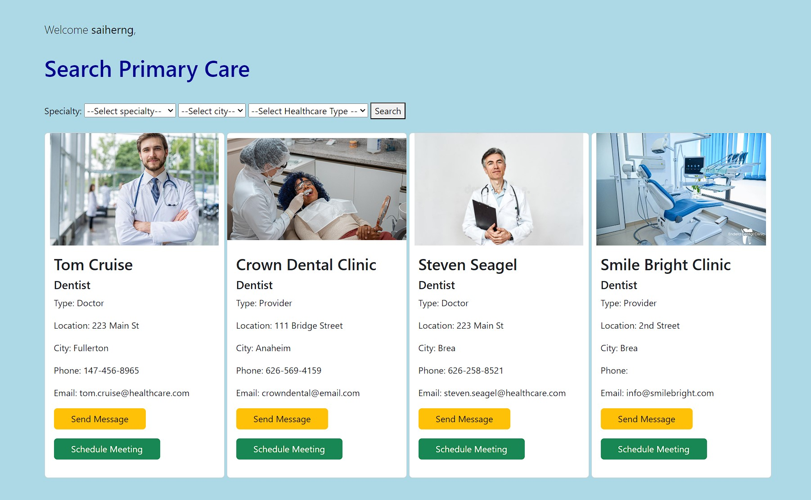
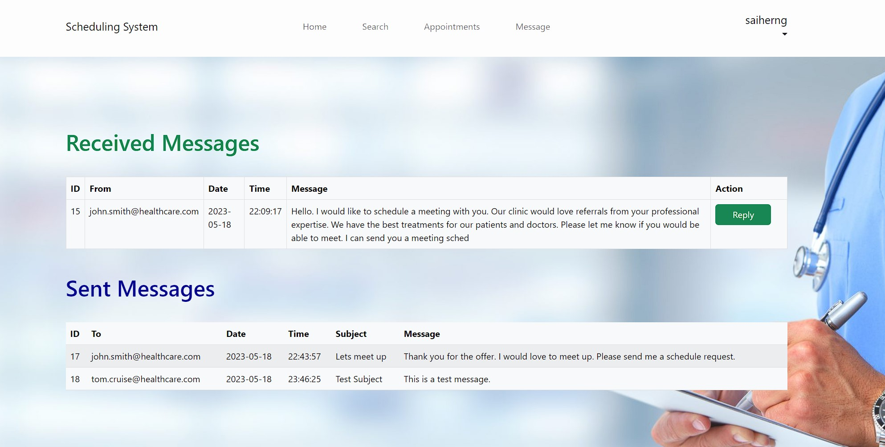

# medicalreferral

View screenshots folder to use UI

.

First Initialization Steps
--------------------------------------
1) Create a new database 'saiherng' using phpmyAdmin. 

2) Import 'saiherng.sql' into the database.

3) Copy source_code folder into htdocs of XAMPP.

4) Run XAMPP Apache Server and SQL Server.

5) Navigate to localhost/source_code/index.php  
